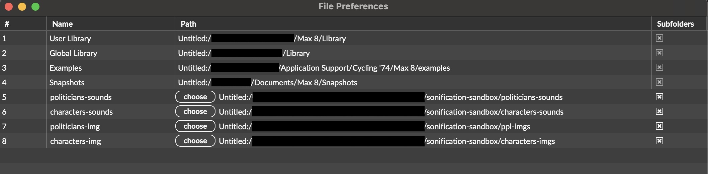

# Sonification Sandbox

## Concept

## How to use
1. Download this project and clone this repo https://github.com/lysdexic-audio/jweb-hands-landmarker.
2. Replace the `jweb-hands-landmarker.maxpat` from lysdexic-audio's project (`jweb-hands-landmarker`) with the patch from this project.
3. Add the folder `title-imgs` into the folder `jweb-hands-landmarker`, then add the contents of `script.js` into the contents of `jweb-hands-landmarker/js/jweb-hands-landmarker.js`. The final code should look something like this
```js
// IIFE for top level await
(async () => { 
const vision = await import("https://cdn.jsdelivr.net/npm/@mediapipe/tasks-vision@0.10.0/vision_bundle.js"); 
const { HandLandmarker, FilesetResolver, DrawingUtils } = vision;

const video = document.getElementById('videoel');
const image = document.getElementById('imageel');
const overlay = document.getElementById('overlay');
const canvas = overlay.getContext('2d');

let handLandmarker;
let camera;

let drawImage = true;
let drawHands = true;
let flipHands = true;
let runningMode = "VIDEO";


// ------- added code ------------
let pointCoordinates={
  //Pinochet, Hitler, Trump, Russia, Netanyahu, Obama
  "blue": [{"x":20, "y":20}, {"x":260, "y":40}, {"x":130, "y":100}, {"x":300, "y":150}, {"x":45, "y":150}, {"x":260, "y":200}],
  //Stalin, Ceausescu, Mao, Mugabe, China, Castro
  "red": [{"x":overlay.width - 50, "y":30}, {"x":overlay.width - 70, "y":80}, {"x":overlay.width-10, "y":110}, {"x":overlay.width-110, "y":80}, {"x":overlay.width-160, "y":110}, {"x":overlay.width-110, "y":140}],
  //nicusor, friedman, basescu, rand, havier, elon
  "yellow": [{"x":300, "y":overlay.height/2 + 20}, {"x":240, "y":overlay.height/2 + 60}, {"x":280, "y":overlay.height/2 + 80}, {"x":20, "y":overlay.height/2 + 150}, {"x":200, "y":overlay.height/2 + 170}, {"x":45, "y":overlay.height-20}],
  //sanders, che, mlk, gandhi, mandela, aoc
  "green": [{"x":overlay.width-110, "y":overlay.height/2 + 20}, {"x":overlay.width-10, "y":overlay.height/2 + 60}, {"x":overlay.width-160, "y":overlay.height/2 + 60}, {"x":overlay.width-100, "y":overlay.height/2 + 60}, {"x":overlay.width-100, "y":overlay.height/2 + 130}, {"x":overlay.width-160, "y":overlay.height/2 + 150}]
}

function drawCompass(canvas){
  // add axis text as photos (dont ask me why)

  const img=new Image();
  const img2=new Image();
  const img3=new Image();
  const img4=new Image();

  img.addEventListener("load", ()=>{
    canvas.drawImage(img, (overlay.width/2)-100, 5, 200, 40);
    canvas.drawImage(img3, overlay.width-50, overlay.height/2-50, 50, 85);
    canvas.drawImage(img2, 0, overlay.height/2-50, 50, 85);
    canvas.drawImage(img4, (overlay.width/2)-80, overlay.height-30, 170, 30);
  });

  img.src="./title-images/auth.png";
  img2.src="./title-images/right.png";
  img3.src="./title-images/left.png";
  img4.src="./title-images/lib.png";

  //create the x and y axis
  canvas.beginPath(); 
  canvas.moveTo(overlay.width/2, 0); 
  canvas.lineTo(overlay.width/2,overlay.height); 
  canvas.stroke(); 

  canvas.beginPath(); 
  canvas.moveTo(0, overlay.height/2); 
  canvas.lineTo(overlay.width,overlay.height/2); 
  canvas.stroke(); 

  for (const color in pointCoordinates){
    canvas.fillStyle=color
    for(const points in pointCoordinates[color]){
      // add the points and output the point coordinates
      canvas.beginPath();
      canvas.arc(pointCoordinates[color][points].x, pointCoordinates[color][points].y, 10, 0, 2 * Math.PI);
      canvas.stroke();
      canvas.fill();
    }
  }
}
// ------- added code ------------

...
```
4. Open the max file, click on `get_mediadevices` (if the camera is not automatically selected), and select your desired input from the dropdown.
5. It's time to create your own performance. Enjoy !!

## Demo


## Troubleshooting
1. "media not found": go to Options -> File Preferences and add the paths to the images and audio files as shown below. 


